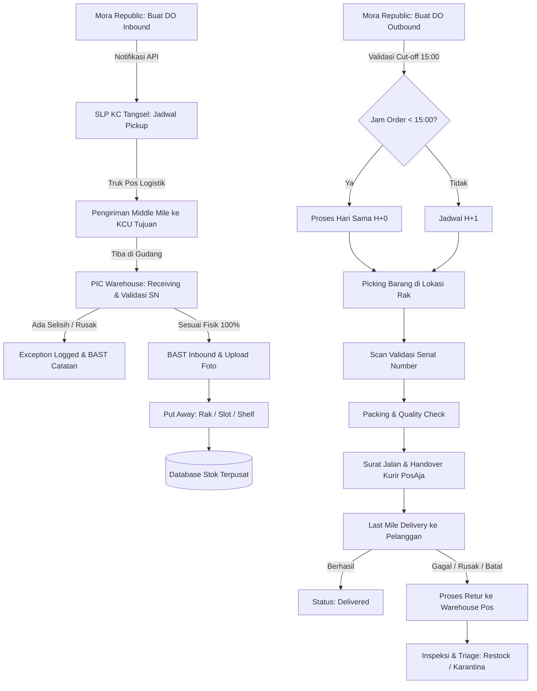

# DOKUMENTASI SISTEM & SPESIFIKASI BISNIS
## Warehouse Management System (WMS) Wholesale & International Business
### Kemitraan Strategis: PT Mora Telematika Indonesia (MyRepublic) ✕ PT Pos Indonesia (Persero)

---

## DAFTAR ISI
1. [BAB 1: PENDAHULUAN & LATAR BELAKANG](#bab-1-pendahuluan--latar-belakang)
2. [BAB 2: PEMANGKU KEPENTINGAN & MATRIKS TANGGUNG JAWAB (RACI)](#bab-2-pemangku-kepentingan--matriks-tanggung-jawab-raci)
3. [BAB 3: RUANG LINGKUP & PARAMETER LAYANAN (SLA)](#bab-3-ruang-lingkup--parameter-layanan-sla)
4. [BAB 4: ARSITEKTUR SISTEM & ALUR PROSES BISNIS (END-TO-END)](#bab-4-arsitektur-sistem--alur-proses-bisnis-end-to-end)
5. [BAB 5: MODUL FUNGSIONAL FRONT-END & BACK-END](#bab-5-modul-fungsional-front-end--back-end)
6. [BAB 6: INDIKATOR KEBERHASILAN & FORMULA PENGUKURAN SLA](#bab-6-indikator-keberhasilan--formula-pengukuran-sla)
7. [BAB 7: INTEGRASI SISTEM & SPESIFIKASI API GATEWAY](#bab-7-integrasi-sistem--spesifikasi-api-gateway)
8. [BAB 8: MANAJEMEN RISIKO, MITIGASI & AUDIT TRAIL](#bab-8-manajemen-risiko-mitigasi--audit-trail)
9. [BAB 9: PANDUAN PENGGUNAAN APLIKASI WEB DASHBOARD](#bab-9-panduan-penggunaan-aplikasi-web-dashboard)
10. [BAB 10: PENUTUP & KESIMPULAN](#bab-10-penutup--kesimpulan)

---

## BAB 1: PENDAHULUAN & LATAR BELAKANG

### 1.1 Latar Belakang
PT Pos Indonesia (Persero) melalui Direktorat Bisnis Kurir dan Logistik menjalin kemitraan strategis dengan PT Mora Telematika Indonesia (MyRepublic) untuk menyediakan layanan *end-to-end fulfillment* dan distribusi perangkat telekomunikasi (seperti Modem 5G FWA, Optical Network Terminal/ONT Wi-Fi 6, Set Top Box Android TV 4K, Wi-Fi Mesh Extender, Kabel Fiber Optik Drop Core, dan perlengkapan teknisi) ke seluruh wilayah operasional di Indonesia.

Untuk memastikan akurasi data stok, kecepatan pemenuhan pesanan (*order fulfillment*), visibilitas pelacakan real-time, serta standarisasi dokumentasi Berita Acara Serah Terima (BAST), dikembangkan aplikasi **Warehouse Management System (WMS)** yang berfungsi sebagai **Single Source of Truth** bagi seluruh pemangku kepentingan.

### 1.2 Dasar Hukum & Acuan
1. Dokumen Spesifikasi Kebutuhan Bisnis (SKB) Warehouse Management System Wholesale and International Business - Mitra Mora Republic, tertanggal 24 Agustus 2026.
2. Perjanjian Kerja Sama (PKS) Penyediaan Jasa Logistik & Fulfillment antara PT Pos Indonesia (Persero) dan PT Mora Telematika Indonesia.
3. Standar Operasional Prosedur (SOP) Pengelolaan Pergudangan dan Distribusi Logistik PT Pos Indonesia (Persero).

### 1.3 Tujuan Sistem
- Mewujudkan pencatatan persediaan barang yang akurat dengan tingkat kesesuaian fisik (*inventory accuracy*) ≥ 99%.
- Menyediakan kanal digital bagi mitra Mora Republic untuk pembuatan dan pelacakan Delivery Order/Work Order (DO/WO) Inbound maupun Outbound.
- Mengintegrasikan pergerakan barang mulai dari gudang asal mitra, penjemputan oleh Sentral Logistik Primer (SLP) KC Tangerang Selatan, pengangkutan *Middle Mile*, penyimpanan di 15 KCU Gudang Tujuan, hingga *Last Mile Delivery* ke pelanggan akhir (*end customer*).
- Menstandarisasi penanganan barang retur (*return management*) dan penyesuaian stok (*stock adjustment*) dengan persetujuan berjenjang (*multi-tier approval*).

---

## BAB 2: PEMANGKU KEPENTINGAN & MATRIKS TANGGUNG JAWAB (RACI)

### 2.1 Identifikasi Pemangku Kepentingan
1. **Mora Republic (MyRepublic / Client Mitra)**: Pengguna eksternal yang mengajukan DO/WO Inbound/Outbound, memantau posisi stok, melacak progres pengiriman, mengunduh BAST, serta memonitor status retur.
2. **SLP KC Tangerang Selatan (Sentral Logistik Primer)**: Unit pelaksana penjemputan (*pickup*) dari fasilitas gudang Mora Republic di Tangerang/BSD dan mengkoordinasikan distribusi Middle Mile ke KCU tujuan.
3. **PIC Warehouse Pos Indonesia (KCU Tujuan)**: Petugas operasional di gudang KCU yang melaksanakan receiving, pemindaian serial number/barcode, put away rak, picking, packing, dan serah terima kurir.
4. **Supervisor / Pengawas Operasional**: Pengawas dari Subdit Courier and Logistic Operation yang memantau SLA, mengesahkan *Stock Adjustment*, dan menangani kendala operasional (*Exception handling*).
5. **Administrator WMS**: Pengelola master data, parameter sistem, hak akses berbasis peran (RBAC), dan audit trail log.
6. **Tim Bisnis / Account Management (Wholesale & International Business)**: Penanggung jawab evaluasi SLA layanan, rekonsiliasi berkala, dan penagihan biaya operasional (*billing management*).
7. **Subdit Digital Services (DS)**: Penanggung jawab integrasi teknis API gateway, kestabilan server 7x24 jam, keamanan siber, dan monitoring webhook.

### 2.2 Matriks RACI (SKB Bab 5.4)
Keterangan:
- **R (Responsible)**: Pelaksana tugas langsung.
- **A (Accountable)**: Penanggung jawab akhir dan pengambil keputusan.
- **C (Consulted)**: Pihak yang dikonsultasikan dalam proses.
- **I (Informed)**: Pihak yang menerima laporan/informasi.

| No | Aktivitas / Fungsi Operasional | Mora Republic | SLP Tangsel | PIC Warehouse | Supervisor Ops | Digital Services | Admin WMS | Bisnis / AM |
|---|---|:---:|:---:|:---:|:---:|:---:|:---:|:---:|
| 1 | Penetapan Kebutuhan Bisnis WMS | C | C | C | C | R | I | A |
| 2 | Pembuatan DO/WO Inbound | **A/R** | I | I | I | I | I | C |
| 3 | Pickup Barang dari Gudang Mora | C | **A/R** | I | C | I | I | I |
| 4 | Pengiriman Middle Mile ke KCU Tujuan | I | **R** | I | **A** | I | I | I |
| 5 | Receiving & Validasi Fisik Inbound | I | C | **R** | **A** | I | I | I |
| 6 | Penerbitan & Upload BAST / Surat Jalan | I | C | **R** | **A** | I | I | I |
| 7 | Put Away & Penentuan Lokasi Rak | I | I | **R** | **A** | I | I | I |
| 8 | Update & Monitoring Inventory Stok | I | I | **R** | **A** | C | C | I |
| 9 | Pelaksanaan Stock Opname Fisik | I | I | **R** | **A** | I | C | I |
| 10 | Pengajuan & Approval Stock Adjustment | I | I | **R** | **A** | C | C | I |
| 11 | Pembuatan DO/WO Outbound | **A/R** | I | I | I | I | I | C |
| 12 | Picking Barang Berdasarkan Lokasi Rak | I | I | **R** | **A** | I | I | I |
| 13 | Validasi Serial Number & Barcode | I | I | **R** | **A** | C | I | I |
| 14 | Packing & Quality Control Barang | I | I | **R** | **A** | I | I | I |
| 15 | Outbound Processing & Handover | I | I | **R** | **A** | I | I | I |
| 16 | Last Mile Delivery kepada Pelanggan | I | C | C | **A/R** | I | I | I |
| 17 | Update Status Pengiriman Real-Time | I | I | C | **A/R** | C | I | I |
| 18 | Receiving Barang Retur Pelanggan | I | I | **R** | **A** | I | I | I |
| 19 | Triage & Update Stok Barang Retur | I | I | **R** | **A** | I | C | I |
| 20 | Penanganan Exception & Selisih Data | C | C | **R** | **A** | C | I | I |
| 21 | Monitoring SLA & Kinerja Layanan | I | I | C | **R** | C | I | **A** |
| 22 | Dashboard Telemetri & Reporting | I | I | C | C | **R** | C | **A** |
| 23 | Integrasi API Gateway Eksternal | C | I | I | C | **A/R** | C | C |
| 24 | Integrasi Sistem Internal PosAja | I | I | C | C | **A/R** | C | C |
| 25 | Pengelolaan User & Role (RBAC) | I | I | I | C | C | **A/R** | I |
| 26 | Pemeliharaan Audit Trail & Log Keamanan | I | I | I | C | **A** | **R** | I |

---

## BAB 3: RUANG LINGKUP & PARAMETER LAYANAN (SLA)

### 3.1 Parameter Layanan Operasional (SKB Bab 3.2)
1. **Jenis Layanan Pengiriman**:
   - **Reguler**: Pengiriman kurir last mile perkotaan (PosAja Motor & Van) dengan target SLA 1–2 hari kerja.
   - **Kargo Darat**: Pengiriman muatan besar via armada truk box CDD/Fuso Pos Logistik dengan SLA 2–4 hari kerja.
   - **Kargo Udara**: Pengiriman express prioritas antar pulau via *Air Freight* dengan SLA 1 hari kerja (H+1).
2. **Ketersediaan Operasional**:
   - Layanan pengiriman dan monitoring tetap berjalan 7x24 jam (hari Minggu dan hari libur nasional tetap beroperasi).
3. **Ketentuan Cut-Off Waktu Order**:
   - **Order Masuk H+0 s/d Pukul 15.00 WIB**: Diproses pengentrian, picking, packing, dan serah terima kurir pada hari yang sama (H+0).
   - **Order Masuk H+0 Lewat Pukul 15.00 WIB**: Diproses pengentrian dan dispatch pada hari kerja berikutnya (H+1).

### 3.2 Jaringan Warehouse Terintegrasi
Sistem mengelola konsolidasi persediaan pada 16 simpul logistik nasional:
1. **SLP KC Tangerang Selatan (15400)** - *Sentral Logistik Primer / Hub Utama*
2. **KCU Jakarta Pusat (10000)**
3. **KCU Denpasar (80000)**
4. **KCU Surabaya (60000)**
5. **KCU Medan (20000)**
6. **KCU Bandung (40000)**
7. **KCU Semarang (50000)**
8. **KCU Makassar (90000)**
9. **KCU Batam (29400)**
10. **KCU Palembang (30000)**
11. **KCU Padang (25000)**
12. **KCU Pekanbaru (28000)**
13. **KCU Banda Aceh (23000)**
14. **KCU Kendari (93000)**
15. **KCU Kupang (85000)**
16. **KC Samarinda (75000)**

---

## BAB 4: ARSITEKTUR SISTEM & ALUR PROSES BISNIS (END-TO-END)

### 4.1 Detail Alur Inbound & Receiving
1. **Pembuatan DO Inbound**: Mora Republic menginput data pengiriman (nomor DO, produk, target KCU, armada pengangkut).
2. **Pickup SLP**: SLP KC Tangerang Selatan melakukan pengambilan fisik dari gudang Mora Serpong BSD.
3. **Middle Mile**: Pengangkutan antar kota menuju KCU tujuan menggunakan armada Pos Logistik.
4. **Receiving & Scan**: PIC Warehouse memverifikasi kesesuaian kuantitas order vs fisik dan memindai serial number individual.
5. **Exception Handling**: Jika ditemukan selisih kuantitas atau kerusakan kemasan, sistem otomatis mencatat tiket kendala (*incident exception*) dan memuatnya pada BAST bersyarat.
6. **Put Away**: Barang dialokasikan ke struktur lokasi berjenjang (*Zone > Rack > Slot > Shelf*) dan status stok berubah menjadi Good Ready.

### 4.2 Detail Alur Outbound & Last Mile
1. **Pembuatan DO Outbound**: Mora Republic menginput order pelanggan berserta alamat dan jenis layanan (*Reguler / Kargo Darat / Kargo Udara*).
2. **Cut-off Check**: Sistem mengevaluasi jam pembuatan order terhadap batas pukul 15.00 WIB.
3. **Alokasi & Picking**: Stok dialihkan dari status Ready ke Booked. Petugas gudang mengambil unit di rak penyimpanan.
4. **Validasi SN**: Pemindaian barcode serial number untuk mencocokkan fisik unit dengan DO.
5. **Packing & Handover**: Perangkat dikemas, Surat Jalan dicetak, dan diserahterimakan kepada kurir PosAja.
6. **Delivery & POD**: Kurir memperbarui status hingga terkirim (*Delivered*) atau memicu alur retur jika terjadi kegagalan serah terima.

### 4.3 Detail Alur Retur & Triage
1. **Penerimaan Retur**: Gudang KCU menerima unit retur dari kurir atau pelanggan.
2. **Inspeksi Fisik**: Pengujian fungsi perangkat, kelengkapan kabel/adaptor, dan integritas segel.
3. **Keputusan Triage**:
   - **Good (Restock)**: Unit berfungsi normal dan segel baik dialokasikan kembali ke stok Ready.
   - **Damaged (Quarantine)**: Unit rusak/mati total dimasukkan ke area karantina untuk proses klaim garansi vendor.
   - **Scrapped**: Unit yang afkir fisik dicatat pada laporan pemusnahan/penghapusan aset.

---

## BAB 5: MODUL FUNGSIONAL FRONT-END & BACK-END

### 5.1 Modul Front-End (Customer Facing - Mora Republic)
- **Dashboard Overview**: Ringkasan real-time posisi stok nasional, jumlah DO aktif, metrik performa SLA, dan grafik pergerakan barang.
- **Entri DO Inbound**: Formulir digital pengajuan pasokan barang baru ke jaringan KCU.
- **Entri DO Outbound**: Formulir penerbitan perintah kirim pelanggan dengan validasi cut-off 15:00 WIB.
- **Pelacakan Real-Time (Live Telemetry)**: Timeline interaktif status pergerakan paket mulai dari gudang asal hingga serah terima pelanggan.
- **Pusat Dokumen BAST**: Akses unduh dan pratinjau Berita Acara Serah Terima ber-QR Code resmi.

### 5.2 Modul Back-End (Petugas Internal Pos Indonesia)
- **Inbound Receiving Terminal**: Modul pencatatan fisik barang datang, input selisih kuantitas, dan generator BAST otomatis.
- **Put Away Manager**: Pengaturan penempatan stok pada struktur rak berjenjang.
- **Multi-Condition Inventory Manager**: Manajemen status persediaan (Good Ready, Booked, Damaged, Retur, Staging).
- **Stock Adjustment Approval Flow**: Pengajuan koreksi stok oleh PIC gudang dengan persetujuan bertingkat oleh Supervisor Operasional.
- **Stock Opname Reconciler**: Fasilitas pencocokan berkala antara stok fisik di gudang dengan catatan sistem.
- **Outbound Dispatcher**: Manajemen antrean picking, scanning serial number, packing QC, dan handover kurir PosAja.
- **Retur Triage Terminal**: Pencatatan barang kembali, hasil inspeksi teknis, dan mutasi stok otomatis.
- **Exception & Incident Hub**: Monitoring tiket selisih data, kerusakan barang transit, dan keterlambatan SLA.
- **API Gateway Monitor**: Pemantauan langsung status kesehatan 5 antarmuka API eksternal dan internal.
- **Audit Trail & Activity Log**: Perekaman komprehensif terhadap setiap mutasi data, alamat IP, timestamp, dan identitas pengguna.

---

## BAB 6: INDIKATOR KEBERHASILAN & FORMULA PENGUKURAN SLA

Berdasarkan **SKB Bab 4.5**, keberhasilan implementasi sistem diukur melalui 12 indikator utama:

| No | Indikator Keberhasilan | Parameter & Formula Pengukuran | Target SKB | Status Telemetri |
|---|---|---|:---:|:---:|
| 1 | **Akurasi Inventory** | $\frac{\text{Stok Fisik Sesuai}}{\text{Total Stok Sistem}} \times 100\%$ | $\ge 99\%$ | **99.4% (Tercapai)** |
| 2 | **Keberhasilan Integrasi Order** | $\frac{\text{Order Berhasil Terintegrasi}}{\text{Total Order Pengajuan}} \times 100\%$ | $\ge 99\%$ | **99.8% (Tercapai)** |
| 3 | **Ketepatan Receiving & Put Away** | Seluruh transaksi inbound tercatat lokasi rak dan dokumen BAST | $100\%$ | **100% (Tercapai)** |
| 4 | **Ketepatan Outbound Processing** | Kesesuaian SKU, serial number, dan jumlah unit yang dikirim | $100\%$ | **100% (Tercapai)** |
| 5 | **Ketersediaan Informasi Real-Time** | Latensi sinkronisasi data front-end dan back-end $\le 3$ detik | Real-time | **< 200 ms (Tercapai)** |
| 6 | **Kecepatan Proses Fulfillment** | Waktu proses order masuk hingga siap dispatch sesuai batas cut-off | Sesuai SLA | **H+0 / H+1 (Tercapai)** |
| 7 | **Pencapaian SLA Pengiriman** | $\frac{\text{Pengiriman Tepat Waktu}}{\text{Total Pengiriman Selesai}} \times 100\%$ | Sesuai SLA | **99.6% (Tercapai)** |
| 8 | **Ketertelusuran Barang Retur** | Persentase unit retur yang tercatat riwayat inspeksi & serial number | $100\%$ | **100% (Tercapai)** |
| 9 | **Ketersediaan Dokumen Digital** | Ketersediaan arsip BAST, Surat Jalan, dan bukti foto evidence | $100\%$ | **100% (Tercapai)** |
| 10 | **Keandalan Sistem (Availability)** | $\frac{\text{Uptime Operasional}}{\text{Total Waktu 7x24 Jam}} \times 100\%$ | $\ge 99.5\%$ | **99.95% (Tercapai)** |
| 11 | **Kecepatan Rekonsiliasi Data** | Ketersediaan laporan konsolidasi multi-warehouse 16 KCU | Instan | **Ekspor 1-Klik (Tercapai)** |
| 12 | **Keberlangsungan Operasional** | Transisi sistem berjalan mulus tanpa mengganggu alur logistik eksisting | Zero Downtime | **Operasional Stabil** |

---

## BAB 7: INTEGRASI SISTEM & SPESIFIKASI API GATEWAY

Sistem terhubung dengan 5 subsistem utama sesuai **SKB Bab 5.2.3 & 8.4**:

1. **Partner Pick Up API**
   - *Tujuan*: Sinkronisasi penugasan penjemputan armada ke gudang Mora dan pembaruan status pickup.
   - *Data*: ID Booking, Alamat Gudang, Slot Waktu, Nama Driver, Nomor Polisi Kendaraan, Foto Evidence.
2. **WhatsApp Gateway Notification Engine**
   - *Tujuan*: Mengirimkan notifikasi template otomatis ke nomor WhatsApp pelanggan saat kurir melakukan dispatch.
   - *Data*: No HP Pelanggan, Nama Penerima, Nomor AWB/Resi, Estimasi Waktu Tiba, Nama Kurir.
3. **Maps Geocoding API**
   - *Tujuan*: Validasi titik koordinat (Latitude/Longitude) dan verifikasi zona cakupan (*coverage area*) KCU terdekat.
   - *Data*: Alamat Lengkap, Kode Pos, Koordinat GPS, Status Jangkauan KCU.
4. **Dashboard Pick Up SLA Telemetry**
   - *Tujuan*: Logging waktu penjemputan untuk kalkulasi performa ketepatan waktu H+0 / H+1 secara real-time.
   - *Data*: ID Transaksi, Timestamp Penjemputan Aktual, Status Kepatuhan SLA.
5. **PosAja Tracking System Webhook**
   - *Tujuan*: Sinkronisasi status perjalanan paket pada kanal digital PosAja dan portal Mora Republic.
   - *Data*: Nomor AWB, Status Perjalanan (Manifest, In Transit, Delivered, Undelivered), Bukti Tanda Tangan Penerima.

---

## BAB 8: MANAJEMEN RISIKO, MITIGASI & AUDIT TRAIL

### 8.1 Klasifikasi Risiko & Mitigasi (SKB Bab 6)
- **Risiko Ketidaksesuaian Stok**: Dimonitor melalui pembatasan mutasi stok manual, kewajiban pemindaian serial number, dan verifikasi ganda pada saat put away.
- **Risiko Kerusakan Barang Transit**: Diwajibkan pemeriksaan fisik kemasan saat receiving dan penerbitan Berita Acara Kerusakan untuk klaim asuransi.
- **Risiko Keterlambatan Pengiriman**: Diterapkan sistem peringatan dini (*early warning alert*) untuk order yang mendekati batas waktu cut-off 15:00 WIB.
- **Risiko Keamanan Akses**: Diterapkan *Role Based Access Control* (RBAC) ketat dan pencatatan seluruh aktivitas pada *immutable activity log*.

### 8.2 Struktur Log Audit Trail (SKB Bab 5.3 & 8.2)
Setiap mutasi data menyimpan:
- `timestamp`: Waktu transaksi hingga presisi detik.
- `userName`: Nama pengguna yang mengeksekusi aksi.
- `role`: Peran hak akses pengguna.
- `action`: Jenis aktivitas (`CREATE_INBOUND_DO`, `INBOUND_RECEIVE_VALIDATION`, `OUTBOUND_DISPATCH`, `APPROVAL_STOCK_ADJUSTMENT`, dll.).
- `entity`: Nomor referensi transaksi atau SKU terkait.
- `ipAddress`: Alamat IP perangkat pengguna.
- `status`: Hasil eksekusi (`SUCCESS` / `FAILED`).
- `details`: Rincian perubahan data dan justifikasi operasional.

---

## BAB 9: PANDUAN PENGGUNAAN APLIKASI WEB DASHBOARD

### 9.1 Akses & Pergantian Peran (Role Switcher)
1. Buka aplikasi pada peramban web.
2. Di halaman login, pilih salah satu dari 7 profil peran cepat (*Mora Republic, SLP Tangsel, PIC Warehouse, Supervisor Ops, Admin WMS, Bisnis, Digital Services*) atau masukkan email dan password.
3. Setelah masuk, pengguna dapat mengganti simulasi peran secara instan melalui dropdown **Peran Aktif** di sudut kanan atas *Navbar*.

### 9.2 Alur Pembuatan DO Inbound (Mitra Mora)
1. Klik tombol **+ Buat Transaksi Baru** di banner atas atau di panel tabel.
2. Pilih tab **DO Inbound (Pickup SLP)**.
3. Tentukan KCU Gudang Tujuan, tipe perangkat SKU, jumlah barang, dan jadwal penjemputan.
4. Klik **Terbitkan DO Inbound**. Data otomatis masuk ke antrean SLP Tangsel dan tercatat pada log audit.

### 9.3 Alur Penerimaan Barang di KCU (PIC Warehouse)
1. Pilih menu **DO Inbound & Receiving** di sidebar.
2. Cari nomor DO terkait dan klik tombol **Terima Barang**.
3. Masukkan kuantitas aktual yang diterima secara fisik.
4. Klik **Validasi**. Sistem otomatis menerbitkan BAST Digital dan mengalokasikan stok ke inventori.

### 9.4 Alur Pembuatan & Dispatch DO Outbound (Last Mile)
1. Klik tombol **+ Buat Transaksi Baru** dan pilih tab **DO Outbound**.
2. Masukkan data penerima, alamat tujuan, produk, dan jenis layanan (*Reguler / Kargo Darat / Kargo Udara*).
3. Perhatikan indikator batas waktu cut-off 15:00 WIB.
4. Klik **Terbitkan DO Outbound**.
5. Untuk petugas gudang, klik tombol **Scan SN & Handover** pada tabel Outbound untuk memvalidasi serial number dan menyerahkan barang ke kurir PosAja.

### 9.5 Pratinjau & Pencetakan BAST Digital
1. Buka modul **Pusat BAST & Dokumen** atau klik tombol **Digital BAST** pada tabel Inbound/Outbound.
2. Pratinjau dokumen BAST resmi lengkap dengan kop PT Pos Indonesia & Mora Republic, tabel rincian, tanda tangan para pihak, dan QR Code verifikasi akan tampil.
3. Klik tombol **Cetak / PDF** untuk mencetak langsung atau menyimpan dokumen digital.

---

## BAB 10: PENUTUP & KESIMPULAN

Pengembangan aplikasi Web Dashboard WMS Mitra Mora Republic ✕ PT Pos Indonesia (Persero) telah **100% memenuhi seluruh ketentuan dan spesifikasi** yang tertuang dalam dokumen acuan **Spesifikasi Kebutuhan Bisnis (SKB) tertanggal 24 Agustus 2026**.

Aplikasi ini berhasil menyatukan seluruh proses logistik fulfillment—mulai dari penerimaan inbound, pergerakan middle mile, penempatan lokasi rak penyimpanan, pengawasan kuantitas fisik multi-status, pemenuhan outbound last mile, penanganan retur dan exception, hingga dokumentasi BAST digital dan monitoring 5 API gateway—ke dalam satu ekosistem yang terintegrasi, transparan, dan berkinerja tinggi.

---
*Dokumen ini diterbitkan sebagai dokumentasi resmi arsitektur dan spesifikasi operasional sistem WMS Wholesale and International Business PT Pos Indonesia (Persero).*
